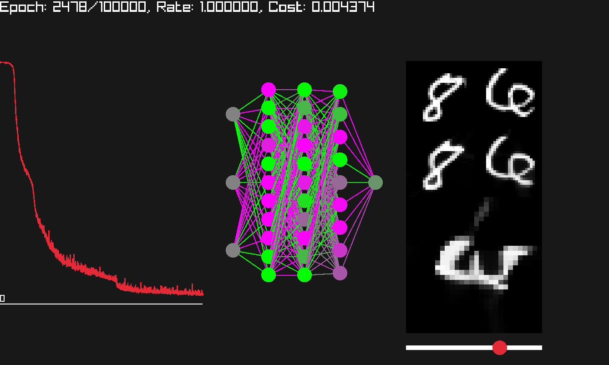

# nn.h

nn.h is a Simple stb-style head-only library for implementing nueral networks


Comes with better memory managment making it much faster than traditional tools used in modern deep learning toolkit

## Quick start

```
$ ./build.sh
$ ./img2nn ./mnist/training/8/10057.png ./mnist/training/6/10032.png
```

## Sailent Features

- [Forward-Forward Algorithm](https://www.cs.toronto.edu/~hinton/FFA13.pdf) - to train neural nets without backpropogration
- [AlphaTensor](https://www.deepmind.com/blog/discovering-novel-algorithms-with-alphatensor) - Perform more efficient matrix multiplication